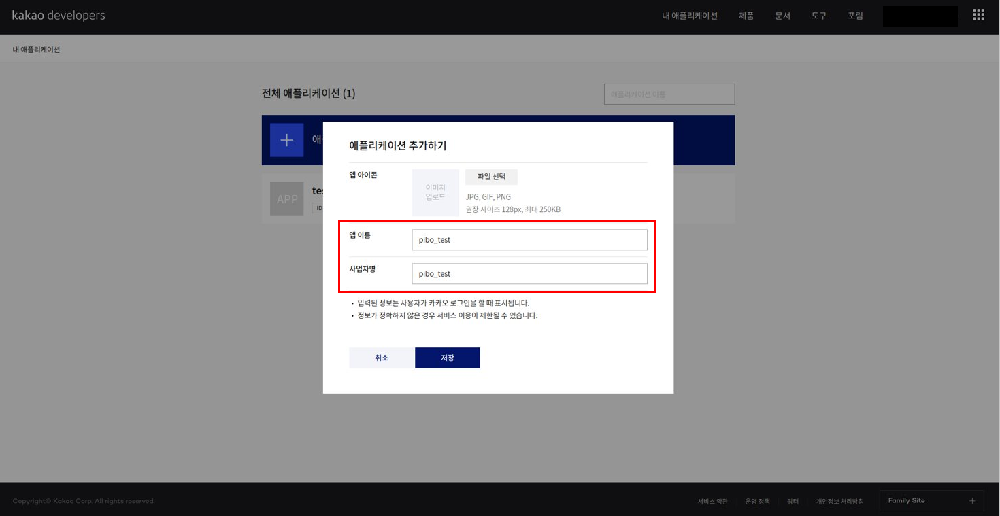
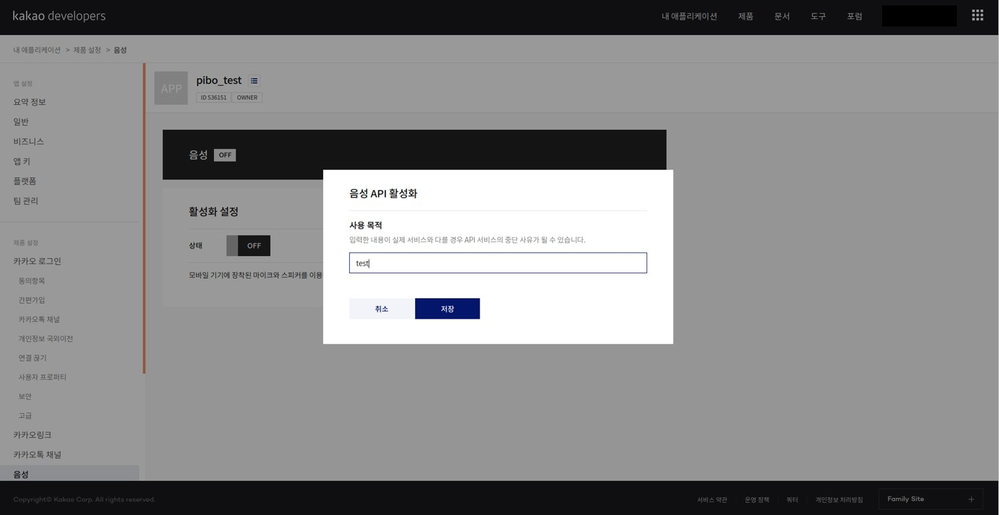

# openpibo Guide

> 새로운 버전의 파이보의 사용법에 대한 가이드입니다.
>
> 코드블럭에서 나타나는 부등호 `< >` 는 변수에 대한 설명이므로 타이핑하지 않습니다.
>
> PIBO 교육용 라이브러리입니다. 아래와 같은 폴더들로 구성되어 있습니다.

1. openpibo: 기능 구현을 위한 패키지
2. openpibo-example: 각 분야 예제 파일 모음
3. openpibo-data: 기능 구현을 위한 실험 데이터
4. openpibo-tools: 교육에 필요한 tools


## INDEX
- [0. 설치 및 설정](#0--------)
- [1. 기존 openpibo 대비 변경사항](#1----openpibo--------)
  * [Class name 변경](#class-name---)
  * [경로 변경](#-----)
    + [import 경로 변경](#import------)
    + [data 경로 변경](#data------)
  * [파일 구조 변경](#--------)
    + [data 파일 구조 변경](#data---------)
    + [라이브러리 구조 변경](#-----------)
- [2. 추가된 기능](#2-------)
  * [HTML Docs](#html-docs)
  * [Process Test](#process-test)
  * [Motion Creator](#motion-creator)
  * [Device Simulator](#device-simulator)


## 설치 및 설정

1. 파이보 SD카드에 `CIRCULUS_EDU_OS`를 설치

2. SD카드 `boot` 레포지토리에서 파일을 생성 및 수정

   - `ssh` 라는 이름의 빈 파일 생성

   - `wpa_supplicant.conf`  파일 수정

     ```
     country=KR
     ctrl_interface=DIR=/var/run/wpa_supplicant GROUP=netdev
     network={
         ssid="YOUR_NETWORK_NAME"
         psk="YOUR_PASSWORD"
         key_mgmt=WPA-PSK
     }
     ```

     - `YOUR_NETWORK_NAME` : 접속하려는 wifi 주소로 수정
     - `YOUR_PASSWORD` : wifi 주소의 비밀번호로 수정

3. 파이보에 SD카드 결합 후 전원 on

4. 컴퓨터에서도 파이보와 같은 네트워크에 접속

5. 컴퓨터에서 파이보로 ssh 접속

   Terminal을 켜고 다름과 같이 입력

   ```bash
   ssh pi@<xxx.xxx.xxx.xxx>
   
   pi@xxx.xxx.xxx.xxx's password: raspberry
   ```

   > pi@ 뒤에는 파이보 OLED에 표시된 ip번호를 입력합니다.
   >
   > 초기 비밀번호는 `raspberry`로 설정되어 있습니다.

6. `lxml` 파서를 설치합니다. `추후 수정 요. os에서 미리 설치`

   ```bash
   sudo apt-get install python3-lxml -y
   ```

7. 각종 openpibo 패키지와 도구들을 설치합니다.

   - 패키지 설치 `수정 요. x 제거`

      ```bash
      git clone https://github.com/themakerrobot/x-openpibo.git
      cd x-openpibo
      sudo python3 setup.py install
      
      # 또는
      
      sudo pip3 install git+https://github.com/themakerrobot/x-openpibo
      ```

   - 추가 도구 설치 `수정 요. x`

      ```bash
      # 샘플 데이터
      git clone https://github.com/themakerrobot/x-openpibo-data.git
      
      # 예제 코드
      git clone https://github.com/themakerrobot/x-openpibo-example.git
      
      # 각종 툴
      git clone https://github.com/themakerrobot/x-openpibo-tools.git
      ```

8. 카카오 api키를 발급받습니다. `수정 요. README 분리 또는 pororo로 변경`

   **Kakao open API** (https://developers.kakao.com/)

   *Speech* 기능을 사용하기 위해 [kakao developers](https://developers.kakao.com/) 회원가입 후 REST API 키를 발급받아야 합니다.

   1. 로그인 후 [내 애플리케이션] 클릭

      

   2. [애플리케이션 추가하기] 클릭

      

   3. 앱 이름 및 사업자명 입력 후 저장

      

   4. 새로 생성한 애플리케이션 클릭

      

   5. config.py에 발급받은 REST API 키 입력 후, 왼쪽의 [음성] 클릭

      

   6. 이후 `/home/pi/config.json`의 `KAKAO_ACCOUNT`에 발급받은 `REST API 키` 입력

      ```json
      {
          "DATA_PATH":"/home/pi/openpibo-data/data/",
          "KAKAO_ACCOUNT": "<여기에 발급받은 REST API 키를 입력해주세요>",
          "robotId": ""
      }
      ```

   7. 활성화 설정의 [OFF] 버튼 클릭

      

   8. 사용 목적 입력 후 저장

      

   9. 활성화 설정의 상태가 [ON]으로 바뀌면 완료

      


## 사용법

### 라이브러리 사용법

> 아래는 `Audio` 라이브러리로 음악을 재생하는 예제입니다. 다른 라이브러리나 메서드는 [document]()를 참고해주시기 바랍니다.

- 먼저 사용하고자 하는 라이브러리를 import합니다.

```python
>>> from openpibo.audio import Audio
```

- `Audio`를 객체에 담고, `play` 메서드를 사용해 음악을 재생시킵니다.
- `<오디오 데이터 경로>` 에는 절대경로, 또는 상대경로가 들어갑니다.

```python
>>> from openpibo.audio import Audio
>>> pibo = Audio()
>>> pibo.play('<오디오 데이터 경로>')
```

- 만약 너무 긴 경로를 반복해서 입력하기 번거롭다면, `config.json` 에 경로를 저장할 수 있습니다.

```json
{
    "DATA_PATH": "home/pi/openpibo-data/data/",
    "KAKAO_ACCOUNT": ...
}
```

- 기본적으로 `DATA_PATH`가 `openpibo-data/data/` 경로로 설정되어있지만, 사용자 임의로 만들 수도 있습니다.

```json
{
    "DATA_PATH": "home/pi/openpibo-data/data/",
    "MY_DATA_PATH": "<my_data_path>/",
    "KAKAO_ACCOUNT": ...
}
```

- `config.json` 는 `openpibo.config` 에 저장되어 있습니다.

```python
>>> import openpibo
>>> openpibo.config
```

```
{"DATA_PATH":"/home/pi/openpibo-data/data/", "MY_DATA_PATH":"<my_data_path>/", ...}
```

- 이를 활용하여 아래와 같이 데이터를 불러올 수 있습니다.

```python
>>> from openpibo.audio import Audio
>>> import openpibo
>>> pibo = Audio()
>>> pibo.play(openpibo.config['MY_DATA_PATH'] + 'test.mp3')
```


## 공식 문서

아래 공식 문서에서 라이브러리에 대한 더욱 자세한 설명을 보실 수 있습니다.

https://themakerrobot.github.io/x-openpibo/build/html/index.html
