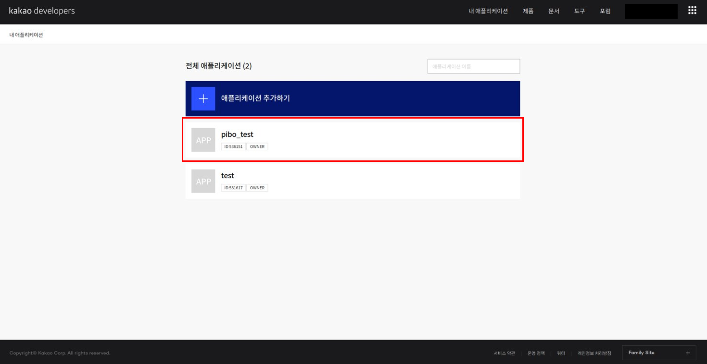

# x-openpibo Guide

> 새로운 버전의 파이보의 사용법에 대한 가이드입니다.
>
> 코드블럭에서 나타나는 부등호 `< >` 는 변수에 대한 설명이므로 타이핑하지 않습니다.
>

## INDEX
- 설치 및 설정
- 기존 openpibo 대비 변경사항
  - Class name 변경
  - 경로 변경
    - import 경로 변경
    - data 경로 변경
  - 파일 구조 변경
    - data 파일 구조 변경
    - 라이브러리 구조 변경
- 추가된 기능
  - HTML Docs
  - Process Test
  - Motion Creator
  - Device Simulator


## 0. 설치 및 설정

1. 파이보 SD카드에 `CIRCULUS_EDU_OS`를 설치

2. SD카드에 다음 파일을 넣습니다.

   - `ssh` : 파일내용 없음.

   - `wpa_supplicant.conf` : 파일내용

     ```
     ctrl_interface=DIR=/var/run/wpa_supplicant GROUP=netdev
     update_config=1
     network={
      ssid="<접속하려는 wifi주소>"
      psk="<wifi주소의 비밀번호>"
     }
     ```

3. 파이보에 SD카드 결합 후 가동

4. ssh로 접속

   console에 다름과 같이 입력

   ```bash
   ssh pi@<xxx.xxx.xxx.xxx>
   
   pi@xxx.xxx.xxx.xxx's password: raspberry
   ```

   > pi@ 옆에는 파이보 OLED에 적혀있는 ip번호를 입력합니다.
   >
   > 초기 비밀번호는 `raspberry`로 설정되어 있습니다.

5. 각종 x-openpibo 패키지와 도구들을 설치합니다.

   - 패키지 설치

      ```bash
      git clone https://github.com/themakerrobot/x-openpibo.git
      cd x-openpibo
      sudo python3 setup.py install
      
      # 또는
      
      sudo pip3 install git+https://github.com/themakerrobot/x-openpibo
      ```

   - 추가 도구 설치

      ```bash
      # 샘플 데이터
      git clone https://github.com/themakerrobot/x-openpibo-data.git
      
      # 예제 코드
      git clone https://github.com/themakerrobot/x-openpibo-example.git
      
      # 각종 툴
      git clone https://github.com/themakerrobot/x-openpibo-tools.git
      ```

6. 카카오 api키를 발급받습니다.

   **Kakao open API** (https://developers.kakao.com/)

   *Speech* 기능을 사용하기 위해 [kakao developers](https://developers.kakao.com/) 회원가입 후 REST API 키를 발급받아야 합니다.

   1. 로그인 후 [내 애플리케이션] 클릭

      

   2. [애플리케이션 추가하기] 클릭

      

   3. 앱 이름 및 사업자명 입력 후 저장

      

   4. 새로 생성한 애플리케이션 클릭

      

   5. config.py에 발급받은 REST API 키 입력 후, 왼쪽의 [음성] 클릭

      

   6. 이후 `/home/pi/config.json`의 `KAKAO_ACCOUNT`에 발급받은 `REST API 키` 입력

      ```json
      {
          "OPENPIBO_DATA_PATH":"/home/pi/x-openpibo-data/data/",
          "KAKAO_ACCOUNT": "<여기에 발급받은 REST API 키를 입력해주세요>",
          "robotId": ""
      }
      ```
   
   7. 활성화 설정의 [OFF] 버튼 클릭
   
      
   
   8. 사용 목적 입력 후 저장
   
      
   
   9. 활성화 설정의 상태가 [ON]으로 바뀌면 완료
   
      
   


## 1. 기존 openpibo 대비 변경사항

### Class name 변경

> 기존 `c`로 시작하는 class name `(cAudio)`에서 앞 글자 `c`가 제거되었습니다.
>
> `Edu_Pibo`가 pibo 패키지에 통합되었고, 확장성을 위해 이름이 `edu_v1`로 변경되었습니다.

```
cAudio  -> Audio
cDevice -> Device
cMotion -> Motion
...
edu.pibo.Edu_Pibo -> openpibo.edu_v1.Pibo
```


### 경로 변경

#### import 경로 변경

> 흩어져있던 library들을 `package`형태로 통합하였습니다.
>
> 이에 따라 `import` 코드가 대폭 줄어들었습니다.

- openpibo

  ```python
  import os, sys, time
  
  # 상위 디렉토리 추가 (for utils.config)
  sys.path.append(os.path.dirname(os.path.abspath(os.path.dirname(__file___))))
  from utils.config import Config as cfg
  
  # openpibo 라이브러리 경로 추가
  sys.path.append(cfg.OPENPIBO_PATH + '/edu')
  from pibo import Edu_Pibo
  ```

- x-openpibo

  ```python
  import openpibo # 파일 경로 사용시 추가
  from openpibo.edu_v1 import Pibo
  ```


#### data 경로 변경

> openpibo로 부터 `config.json`의 경로를 참조할 수 있습니다. __단, `config.json`은 최상단 디렉토리 `/home/pi/`에 위치해야 합니다.__
>
> 이에 따라 data 경로를 찾는 방식이 간소화되었습니다.
>
> 추가적으로, 파일 경로에 슬래시 `/`를 포함하여 추가적인 슬래시 `/`를 사용하지 않아도 됩니다.(`config.json`에서 변경하실 수 있습니다.)

- openpibo

  ```python
  sys.path.append(os.path.dirname(os.path.abspath(os.path.dirname(__file___))))
  from utils.config import Config as cfg
  
  
  pibo = cAudio()
  
  pibo.play(cfg.TESTDATA_PATH + '/audio/test.mp3')
  ```

- x-openpibo

  ```python
  import openpibo
  
  
  pibo = Audio()
  
  pibo.play(openpibo.data_path + 'audio/test.mp3')
  ```

> 레포지토리마다 따로 설정되었던 `config.py`파일이 `config.json` 하나로 통합되었습니다.
>
> `config 파일`의 구성이 일부 변경되었습니다.

- onfig.py

  ```python
  class Config:
    OPENPIBO_PATH="/home/pi/openpibo"
    OPENPIBO_DATA_PATH="/home/pi/openpibo-data"
    TESTDATA_PATH =OPENPIBO_DATA_PATH+"/testdata"
    PROC_PATH =OPENPIBO_DATA_PATH+"/proc"
    MODEL_PATH=OPENPIBO_DATA_PATH+"/models"
    KAKAO_ACCOUNT="YOUR REST API KEY"
  ```

- config.json

  ```json
  {
      "OPENPIBO_DATA_PATH": "/home/pi/x-openpibo-data/data/",
      "KAKAO_ACCOUNT": "YOUR REST API KEY",
      "robotId": ""
  }
  ```


### 파일 구조 변경

#### data 파일 구조 변경

> 패키지 사용을 위한 필수 데이터인 `models`와 `proc` 폴더 등이 `x-openpibo`로 이전하였습니다. (그러나 데이터 관리의 어려움 때문에 다시 변경될 수 있습니다)
>
> `testdata`를 각각 형식에 따라 `images`, `icon`, `audio`로 분할 했습니다.

- openpibo-data

  ```
  openpibo-data/
  ├── models
  │   ├── MobileNetSSD_deploy.caffemodel
  │   ├── MobileNetSSD_deploy.prototxt.txt
  │   ├── age_net.caffemodel
  │   ├── deploy_age.prototxt
  │   ├── deploy_gender.prototxt
  │   ├── dlib_face_recognition_resnet_model_v1.dat
  │   ├── gender_net.caffemodel
  │   ├── haarcascade_frontalface_default.xml
  │   └── shape_predictor_5_face_landmarks.dat
  ├── proc
  │   ├── KDL.ttf
  │   ├── dialog.csv
  │   ├── motion_db.json
  │   └── sample_db.json
  └── testdata
      ├── always-with-you.mp3
      ├── bus.jpg
      ├── clear.png
      ├── closing.mp3
      ├── come-true.mp3
      ├── eng_ocr.jpg
      ├── hello_qr.png
      ├── icon
      │   ├── bot.png
      │   ├── camera.png
      │   ├── check.png
      │   ├── clock_side.png
      │   ├── conversation.png
      │   ├── mic.png
      │   ├── pibo_logo.png
      │   ├── walk.png
      │   └── weather_bot.png
      ├── kr_ocr.jpg
      ├── link.mp3
      ├── livingroom.jpg
      ├── num_ocr.jpg
      ├── ocr_eng.jpg
      ├── opening.mp3
      ├── sittingroom.jpg
      ├── test.mp3
      ├── tts.mp3
      ├── vision_sample.jpg
      ├── vision_sample2.jpg
      └── vision_sample3.jpg
  ```

- x-openpibo-data

  ```
  x-openpibo-data/
  └── data
      ├── audio
      │   ├── always-with-you.mp3
      │   ├── closing.mp3
      │   ├── come-true.mp3
      │   ├── link.mp3
      │   ├── opening.mp3
      │   ├── test.mp3
      │   └── tts.mp3
      ├── icon
      │   ├── bot.png
      │   ├── camera.png
      │   ├── check.png
      │   ├── clock_side.png
      │   ├── conversation.png
      │   ├── mic.png
      │   ├── pibo_logo.png
      │   ├── walk.png
      │   └── weather_bot.png
      └── images
          ├── bus.jpg
          ├── clear.png
          ├── eng_ocr.jpg
          ├── hello_qr.png
          ├── kr_ocr.jpg
          ├── livingroom.jpg
          ├── num_ocr.jpg
          ├── ocr_eng.jpg
          ├── sittingroom.jpg
          ├── vision_sample.jpg
          ├── vision_sample2.jpg
          └── vision_sample3.jpg
  ```


#### 라이브러리 구조 변경

> 기존의 기능별 레포지토리 구분이 없어지고, module만 따로 관리합니다.
>
> 기능 수행에 필수적인 데이터(model등)도 포함되었습니다. (추후 변경 여지 있음)

- openpibo

  ```
  openpibo/lib/
  ├── audio
  │   ├── README.md
  │   └── audiolib.py
  ├── device
  │   ├── README.md
  │   └── devicelib.py
  ├── motion
  │   ├── README.md
  │   └── motionlib.py
  ├── oled
  │   ├── README.md
  │   ├── busio.py
  │   ├── chip.py
  │   ├── digitalio.py
  │   ├── framebuf.py
  │   ├── oledlib.py
  │   ├── pure_spi.py
  │   ├── spi.py
  │   ├── spi_device.py
  │   ├── ssd1306.py
  │   └── util.py
  ├── servo
  │   ├── Makefile
  │   ├── README.md
  │   ├── config.hpp
  │   ├── servo.cpp
  │   └── servo.hpp
  ├── speech
  │   ├── README.md
  │   └── speechlib.py
  └── vision
      ├── README.md
      ├── stream.py
      └── visionlib.py
  
  openpibo/edu/
  └── pibo.py
  ```
  
- x-openpibo

  ```
  x-openpibo/openpibo
  ├── __init__.py
  ├── audio.py
  ├── collect.py
  ├── device.py
  ├── edu_v1.py
  ├── motion.py
  ├── oled.py
  ├── speech.py
  ├── vision.py
  ├── modules
  │   ├── __init__.py
  │   ├── collect
  │   │   ├── __init__.py
  │   │   └── get_soup.py
  │   ├── oled
  │   │   ├── __init__.py
  │   │   ├── board.py
  │   │   ├── busio.py
  │   │   ├── chip.py
  │   │   ├── digitalio.py
  │   │   ├── framebuf.py
  │   │   ├── pure_spi.py
  │   │   ├── spi.py
  │   │   ├── spi_device.py
  │   │   ├── ssd1306.py
  │   │   └── util.py
  │   ├── speech
  │   │   ├── __init__.py
  │   │   ├── constant.py
  │   │   └── google_trans_new.py
  │   └── vision
  │       ├── __init__.py
  │       └── stream.py
  └── data
      └── models
          ├── KDL.ttf
          ├── MobileNetSSD_deploy.caffemodel
          ├── MobileNetSSD_deploy.prototxt.txt
          ├── age_net.caffemodel
          ├── deploy_age.prototxt
          ├── deploy_gender.prototxt
          ├── dialog.csv
          ├── dlib_face_recognition_resnet_model_v1.dat
          ├── gender_net.caffemodel
          ├── haarcascade_frontalface_default.xml
          ├── motion_db.json
          ├── sample_db.json
          └── shape_predictor_5_face_landmarks.dat
  ```
  


## 2. 추가된 기능

### HTML Docs

> https://themakerrobot.github.io/x-openpibo/build/html/index.html
>
> openpibo의 함수에 대한 설명을 볼 수 있는 `html 문서` 입니다.
>
> 현재 `Audio` 기능이 정리되어있으며, 3개월 내에 다른 기능도 문서화 할 계획입니다.
>
> 이후에는 함수 설명 뿐만 아니라 openpibo에 대한 모든 `README.md` 의 내용이 저장 될 것입니다.


### Process Test

> 파이보 부품들의 정상 동작 여부를 테스트하는 프로그램입니다.
>
> 구동 시 serial_number, firmware 정보를 확인할 수 있습니다.
>
> test 진행 후 정상 동작 여부를 `y / n` 커멘드를 통해 기록할 수 있습니다.
>
> 기존의 `device` 테스트를 `pir`, `touch`, `button`, `dc`, `battery` 로 분리하였습니다.
>
> 일부 디자인이 변경되었습니다.

__사용 방법__
```python
cd ~/x-openpibo-tools/process-test
python3 main.py
```


### Motion Creator

> 파이보의 동작을 생성하는 툴 입니다.
>
> 좌측 상단으로 모터를 조작하고 저장하면 우측 상단의 테이블에 기록됩니다.
>
> 동작이 완성되면 우측 하단에서 `export` 가 가능하며, `모션이름.json` 파일로 저장됩니다.
>
> python으로 재구성되었으며, 일부 디자인이 변경되었습니다.

__사용 방법__
```python
cd ~/x-openpibo-tools/motion-creator
python3 main.py
```
이후 `https://<PIBO IP>:8888`에 접속


### Device Simulator

> 파이보의 device를 제어할 수 있는 툴 입니다.
>
> 디바이스 부품(neopixel, battery, dc, button, pir, touch)을 제어하거나 상태를 확인할 수 있습니다.

__사용 방법__
```python
cd ~/x-openpibo-tools/device-test
python3 main.py
```
이후 `https://<PIBO IP>:8888`에 접속


