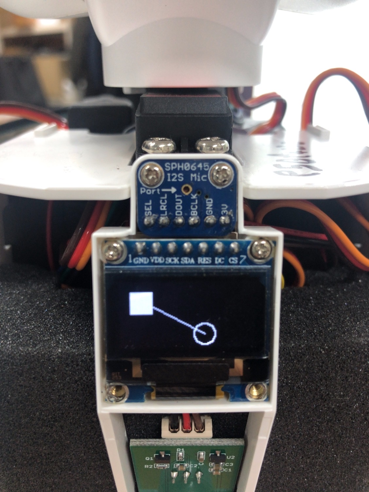
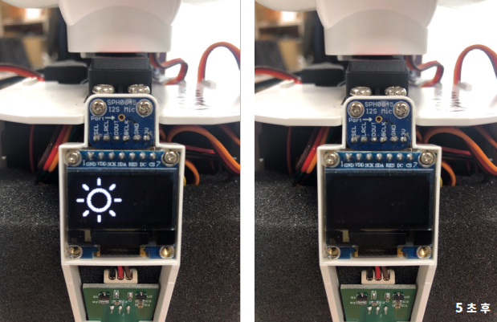
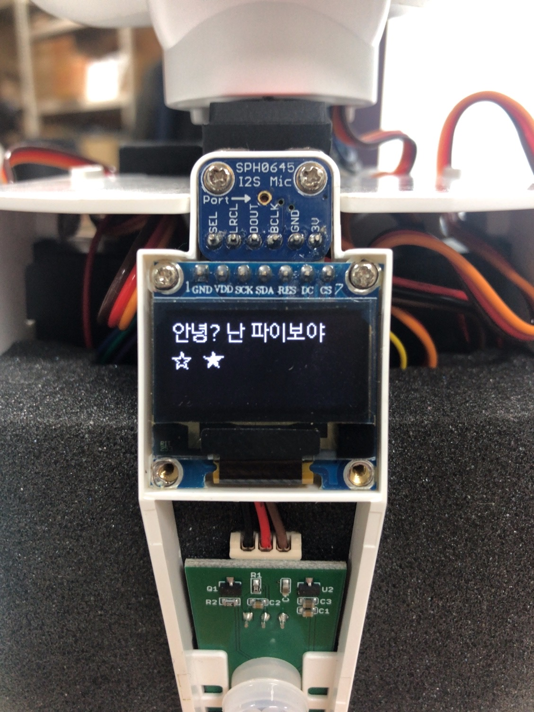

# oled

## figure_test.py

OLED display에 도형과 선을 출력합니다.

```python
from openpibo.oled import Oled

def oled_f():
  oObj = Oled()
  oObj.clear()                              # 화면 지우기
  oObj.draw_rectangle((10,10,30,30) ,True)  # 길이가 20인 채워진 사각형 그리기
  oObj.draw_ellipse((70,40,90,60) ,False)   # 지름이 20인 빈 원 그리기
  oObj.draw_line((15,15,80,50))             # 선 그리기
  oObj.show()                               # 화면에 표시

if __name__ == "__main__":
  oled_f()
```

**figure_test.py 실행**

```shell
pi@raspberrypi:~/openpibo-examples/oled $ sudo python3 figure_test.py 
```

**figure_test.py 결과**



## image_test.py

OLED display에 이미지를 출력합니다. (128X64만 가능합니다.)

```python
import openpibo
from openpibo.oled import Oled

import time

# 화면에 clear.png 이미지 5초간 표시
def oled_f():
  oObj = Oled()
  oObj.draw_image(openpibo.config['DATA_PATH']+"/images/clear.png")  # clear.png 그리기
  oObj.show()   # 화면에 표시
  time.sleep(5) # 5초동안 프로세스 정지
  oObj.clear()  # 화면 지우기
  oObj.show()

if __name__ == "__main__":
  oled_f()
```

**image_test.py 실행**

```shell
pi@raspberrypi:~/openpibo-examples/oled $ sudo python3 image_test.py
```

**image_test.py 결과**



## self_test.py

직접 실습해보세요.

```python
from openpibo.oled import Oled

def oled_f():
  print('my oled design')


if __name__ == "__main__":
  oled_f()
```

**self_test.py 실행**

```shell
pi@raspberrypi:~/openpibo-examples/oled $ sudo python3 self_test.py
```

## text_test.py

OLED display에 문자열을 출력합니다.

```python
from openpibo.oled import Oled

# (0,0), (0,20)에 15 크기의 text 표시
def oled_f():
  oObj = Oled()
  oObj.set_font(size=15)
  
oObj.draw_text((0, 0), "안녕? 난 파이보야 ")  # (0,0)에 문자열 출력
  oObj.draw_text((0,20), "☆  ★ ") # (0,20)에 문자열 출력
  oObj.show() # 화면에 표시

'''
  for count in range(5):
    oObj.clear()
    oObj.draw_text((10,10), "Hello World:{}".format(count))
    oObj.show()
    time.sleep(1)

  oObj.clear()
'''

if __name__ == "__main__":
  oled_f()
```

**text_test.py 실행**

```shell
pi@raspberrypi:~/openpibo-examples/oled $ sudo python3 text_test.py
```

**text_test.py 결과**

