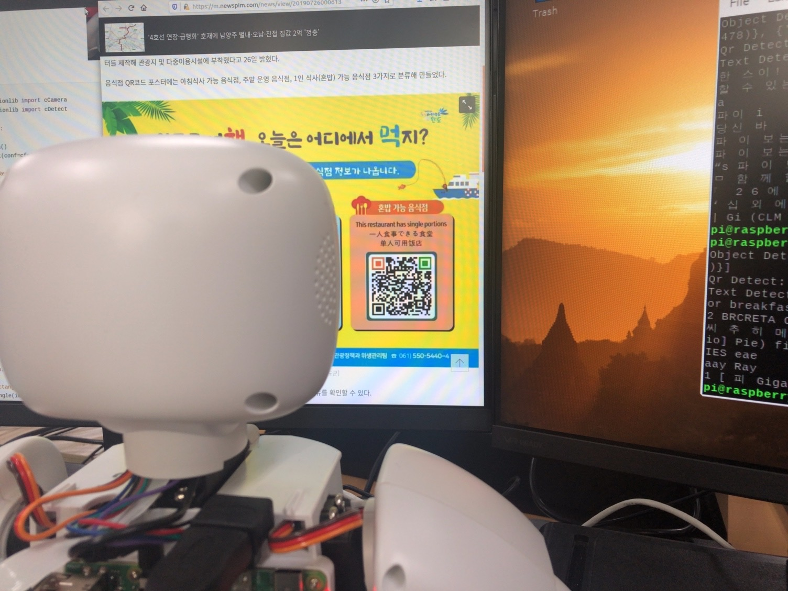
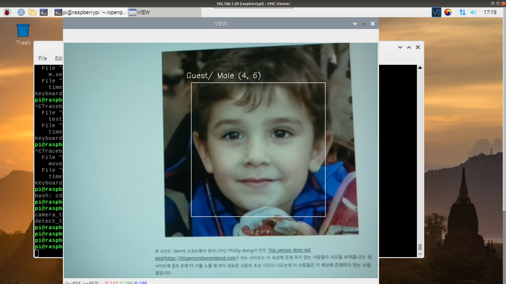

# vision

- OpenCV DNN 모듈

  - 딥러닝 학습은 Caffe 프레임워크에서 진행하고, 학습된 모델을 dnn 모듈로 불러와서 실행(`cv2.dnn.readNet()`)

## camera_test.py

사진을 촬영하고 저장합니다.

```python
from openpibo.vision import Camera

def test_func():
  # instance
  cam = Camera()

  # Capture / Read file
  # 이미지 촬영
  img = cam.read()
  #img = cam.imread("/home/pi/test.jpg")

  # Write(test.jpg라는 이름을 촬영한 이미지 저장)
  cam.imwrite("test.jpg", img)

  # display (only GUI): 3초동안 'TITLE'이라는 제목으로 이미지 보여줌
  cam.imshow(img, "TITLE")
  cam.waitKey(3000) # 단위: ms

if __name__ == "__main__":
  test_func()
```

**camera_test.py 실행**

```shell
pi@raspberrypi:~/openpibo-examples/vision $ sudo python3 camera_test.py 
```

**camera_test.py 결과**


## detect_test.py

이미지의 객체/QR코드/문자를 인식합니다.

```python
from openpibo.vision import Camera
from openpibo.vision import Detect

def test_func():
  # instance
  cam = Camera()  # Camera 클래스에 대한 객체 생성
  det = Detect()

  # Capture / Read file
  img = cam.read()
  #img = cam.imread("image.jpg")

  print("Object Detect: ", det.detect_object(img))  # 객체 인식
  print("Qr Detect:", det.detect_qr(img))           # QR코드 인식
  print("Text Detect:", det.detect_text(img))       # 문자 인식

if __name__ == "__main__":
  test_func()
```

**detect_test.py 실행**

```shell
pi@raspberrypi:~/openpibo-examples/vision $ sudo python3 detect_test.py 
```

**detect_test.py 결과**

```shell
Object Detect:  [{'name': 'bus', 'score': 80.67924976348877, 'position': (2, 0, 627, 478)}]
Qr Detect: {'data': 'http://www.wando.go.kr/l04xd2@', 'type': 'QRCODE'}
Text Detect: ’
> fxr
cends, This restaurant has ungie portions
—ARBTSORE
ㅅ 피 메 엔 로
oO a |
Fs
```



## draw_test.py

이미지에 그림과 글씨를 입력합니다.

```python
from openpibo.vision import Camera

def test_func():
  # instance
  cam = Camera()

  # Capture / Read file
  img = cam.read()
  #img = cam.imread("/home/pi/test.jpg")

  # Draw rectangle, Text
  cam.rectangle(img, (100,100), (300,300))    # 화면의 (100,100), (300,300) 위치에 사각형 그리기
  cam.putText(img, "Hello Camera", (50, 50))  # 화면의 (50,50) Hello Camera 쓰기

  # Write
  cam.imwrite("test.jpg", img)  # test.jpg로 이미지 저장

  # display (only GUI): 3초동안 'TITLE'이라는 제목으로 이미지 보여줌
  cam.imshow(img, "TITLE")
  cam.waitKey(3000)

if __name__ == "__main__":
  test_func()
```

**draw_test.py 실행**

```shell
pi@raspberrypi:~/openpibo-example/vision $ sudo python3 draw_test.py
```

**draw_test.py 결과**


## face_recognize_test.py

이미지에서 얼굴을 찾아 나이와 성별을 추정합니다. 

```python
from openpibo.vision import Camera
from openpibo.vision import Face

def test_f():
  # instance
  cam = Camera()
  faceObj = Face()

  # Capture / Read file
  img = cam.read()
  #img = cam.imread("/home/pi/test.jpg")
 
  disp = img.copy()

  # detect faces
  faceList = faceObj.detect(img)

  if len(faceList) < 1:
    print("No face")
    return 
 
  # get ageGender
  ret = faceObj.get_ageGender(img, faceList[0])
  age = ret["age"]
  gender = ret["gender"]

  # draw rectangle
  x,y,w,h = faceList[0]  
  cam.rectangle(disp, (x,y), (x+w, y+h))

  # recognize using facedb(동일인이라 판정되면 이름, 아니면 Guest)
  ret = faceObj.recognize(img, faceList[0])
  name = "Guest" if ret == False else ret["name"]

  cam.putText(disp, "{}/ {} {}".format(name,gender,age), (x-10, y-10), size=0.5)

  # display (only GUI): 모니터에서 3초간 VIEW라는 제목으로 이미지 확인
  cam.imshow(disp, "VIEW")
  cam.waitKey(3000)

  # Write: test.jpg로 이미지 저장
  cam.imwrite("test.jpg", disp)

if __name__ == "__main__":
  test_f()
```

**face_recognize_test.py 실행**

```shell
pi@raspberrypi:~/openpibo-examples/vision $ sudo python3 face_recognize_test.py 
```

**face_recognize_test.py 결과**



## face_train_test.py

이미지에서 얼굴을 찾아 학습하여 데이터베이스에 저장하고 로드한  뒤 다시 삭제합니다.

```python
from openpibo.vision import Camera
from openpibo.vision import Face

def test_func():
  # instance
  cam = Camera()
  faceObj = Face()

  print("Start DB:", faceObj.get_db()[0])
  
  # Capture / Read file
  img = cam.read()
  #img = cam.imread("/home/pi/test.jpg")

  # Train face
  faces = faceObj.detect(img)
  if len(faces) < 1:
    print(" No face")
  else:
    # 얼굴 학습(학습할  이미지 데이터, 얼굴 1개 위치, 학습할 얼굴 이름)
    print(" Train:", faceObj.train_face(img, faces[0], "yjlee"))
  print("After Train, DB:", faceObj.get_db()[0])

  img = cam.read()
  faces = faceObj.detect(img)
  if len(faces) < 1:
    print(" No face")
  else:
    print(" Recognize:", faceObj.recognize(img, faces[0]))

  # Save DB
  faceObj.save_db("./facedb")

  # Reset DB
  faceObj.init_db()
  print("After reset db, DB:", faceObj.get_db()[0])
  
  # Load DB
  faceObj.load_db("facedb")
  print("After Load db, DB:", faceObj.get_db()[0])

  # delete Face
  faceObj.delete_face("yjlee")
  print("After Delete face:", faceObj.get_db()[0])

if __name__ == "__main__":
  test_func()
```

**face_train_test.py 실행**

```shell
pi@raspberrypi:~/openpibo-examples/vision $ sudo python3 face_train_test.py
```

**face_train_test.py 결과**

```python
Start DB: []
 Train: None
After Train, DB: ['yjlee']
 Recognize: {'name': 'yjlee', 'score': 0.02}
After reset db, DB: []
After Load db, DB: ['yjlee']
After Delete face: []
```

## streaming_test.py

모니터에 이미지를 스트리밍합니다.

```python
from openpibo.vision import Camera

# 모니터에 3초간 이미지 스트리밍
def test_func():
  # instance
  cam = Camera()

  # For streaming (only GUI)
  cam.streaming(timeout=3)

if __name__ == "__main__":
  test_func()
```

**streaming_test.py 실행**

```shell
pi@raspberrypi:~/openpibo-examples/vision $ sudo python3 streaming_test.py 
```

**streaming_test.py 결과**

