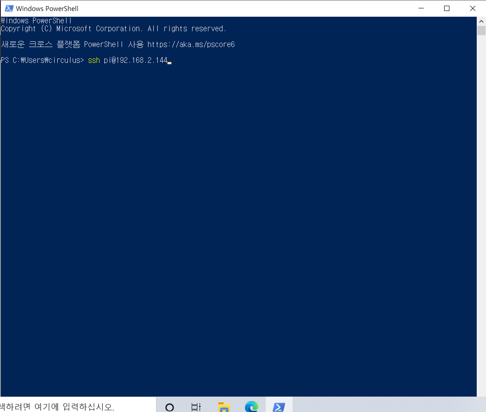
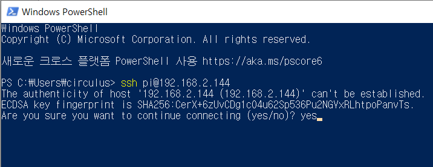
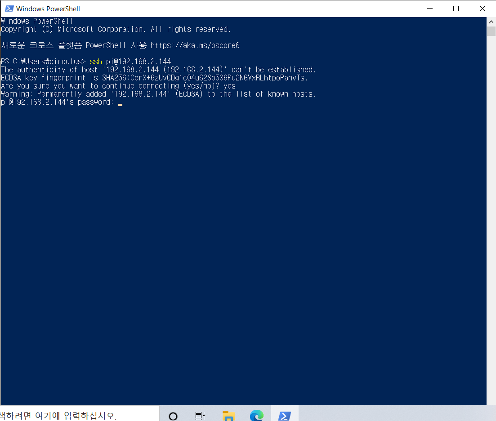
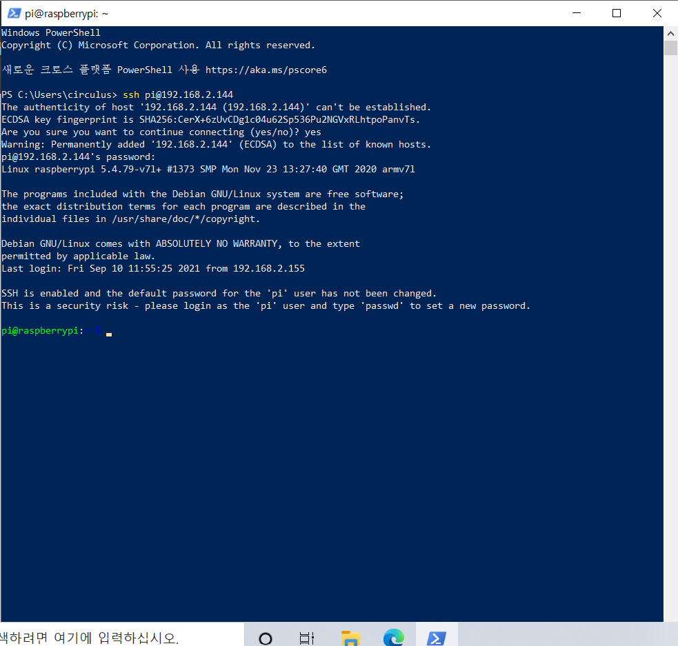

# 기본설정 및 부가설정

## 기본 설정

> 파이보 조립 이후 파이보를 사용하기 위한 기본적인 설정 방법에 대해 안내합니다.

1. 무선 인터넷(wifi)을 연결합니다.

   - microSD카드를 USB 어뎁터에 연결하고, 이를 컴퓨터에 연결합니다.

   
   
   - microSD카드 `boot` 디렉토리에서 `wpa_supplicant.conf` 파일을 수정합니다.

     ```
     country=KR
     ctrl_interface=DIR=/var/run/wpa_supplicant GROUP=netdev
     network={
         ssid="YOUR_NETWORK_NAME"
         psk="YOUR_PASSWORD"
         key_mgmt=WPA-PSK
     }
     ```

     - `YOUR_NETWORK_NAME` : 접속하려는 wifi 주소로 수정
     - `YOUR_PASSWORD` : wifi 주소의 비밀번호로 수정

   **<주의> microSD카드로 부팅을 하게되면 `wpa_supplicant.conf` 파일이 사라집니다.**

      만약 새로운 네트워크에 접속하려면, `wpa_supplicant.conf.bak` 파일을 복사하여
      
      새로운 `wpa_supplicant.conf` 를 만들어 wifi 설정 후 사용합니다.

      

2. 파이보에 microSD카드 결합 후 전원을 켭니다.

   

   파이보의 등껍질을 열고, 오른쪽 겨드랑이 부분에 삽입합니다.

   이 때, 왼쪽의 금박 부분을 바라보는 방향으로 삽입합니다.

3. 컴퓨터에서도 파이보와 같은 네트워크에 접속합니다.

4. 컴퓨터에서 파이보로 ssh 접속 합니다.

   > ssh란, 원격으로 다른 컴퓨터와 통신을 할 수 있는 방법입니다.
   >
   > 이를 통해 컴퓨터를 사용해 파이보를 제어할 수 있게 됩니다.

   터미널 창을 켜고 다음과 같이 입력합니다.

   *<참고> 여기서 터미널은 windows 운영체제에서는 **PowerShell**이고, linux에서는 **Terminal** 입니다.*

   

   이 때, `ssh pi@` 뒤 숫자는 파이보의 IP 입니다.

   이 숫자는 파이보 가슴의 oled에서 확인할 수 있습니다.

   IP를 입력하면, 다음과 같은 메시지가 출력됩니다.

   

   처음으로 파이보에 ssh로 접속할 때 출력되는 메시지로, 보안키를 생성한다는 메시지 입니다.

   `yes` 를 타이핑 하면 보안키가 생성됩니다.

   

   패스워드를 입력합니다.

   파이보를 처음 실행시킬때 기본 비밀번호는 `raspberry` 로 설정되어있습니다.

   이 때 타이핑을 해도 반응이 없어보이지만 입력되는 중이기 때문에, 그냥 비밀번호를 타이핑하고 엔터를 치면 됩니다.

   

   연결이 완료되면 위 그림과 같이 코드 맨 아래에 `pi@raspberrypi:~ $` 가 출력됩니다.

## 부가 설정

> 부가적인 기능을 사용하거나 패키지, 도구를 재설치하는 방법에 대해 안내합니다.

1. TTS(텍스트를 음성으로 변환), STT(음성을 텍스트로 변환) 등의 기능을 사용하기 위해 `KAKAO REST API KEY` 를 발급받습니다.

   openpibo의 TTS와 STT는 KAKAO에서 제공하는 서비스를 사용합니다.

   해당 서비스를 이용하기 위해서는 `KAKAO REST API KEY`가 필요합니다.

   따라서 TTS와 STT 기능을 사용하기 위해서는 kakao developers에 회원가입 후 REST API KEY를 발급받아야 합니다.

   해당 설정을 하는 방법은 [여기](https://themakerrobot.github.io/x-openpibo/build/html/notes/kakao_api.html)를 참고해주세요.

2. 각종 x-openpibo 패키지와 도구들을 설치하는 방법입니다.

   파이보 제품을 받았을 때 기본적으로 설치가 되어 있지만,

   데이터를 잃어버리거나 실수로 중요한 파일을 수정했을 경우 패키지와 도구를 재설치 할 때 사용합니다.

   - 패키지 설치

      패키지는 파이보를 조작하는 기능이 있는 파일들입니다.

      파이보의 모터를 움직이거나, 오디오를 재생하는 등의 기능을 할 수 있도록 합니다.

      ```bash
      $ sudo pip3 install git+https://github.com/themakerrobot/x-openpibo
      
      # 또는
      
      $ git clone https://github.com/themakerrobot/x-openpibo.git # 패키지 파일 다운로드
      $ cd x-openpibo # 다운받은 패키지 폴더에 접근
      $ sudo python3 setup.py install # 패키지 설치
      ```

   - 추가 도구 설치

      - x-openpibo-tools

         파이보를 다루는데 여러가지 도움을 주는 도구모음입니다.

         파이보 조립 후 조립이 잘 됐는지 확인하거나, 파이보의 모션을 만드는 등의 일을 할 수 있습니다.

         ```bash
         $ git clone https://github.com/themakerrobot/x-openpibo-tools.git
         ```

      - x-openpibo-example

         패키지를 사용한 예제 코드들의 모음입니다.

         패키지를 어떻게 사용해야 하는지 알고 싶을 때 참고할 수 있습니다.

         참고로, `x-openpibo-data`의 데이터를 사용하기 때문에,
         
         예제코드를 사용하기 전에 `x-openpibo-data`도 정상적으로 설치되어있어야 합니다.

         ```bash
         $ git clone https://github.com/themakerrobot/x-openpibo-example.git
         ```
      
      - x-openpibo-data

         샘플로 사용할 수 있는 간단한 데이터 모음입니다.

         오디오, 아이콘, 이미지 파일이 들어있습니다.

         ```bash
         $ git clone https://github.com/themakerrobot/x-openpibo-data.git
         ```
