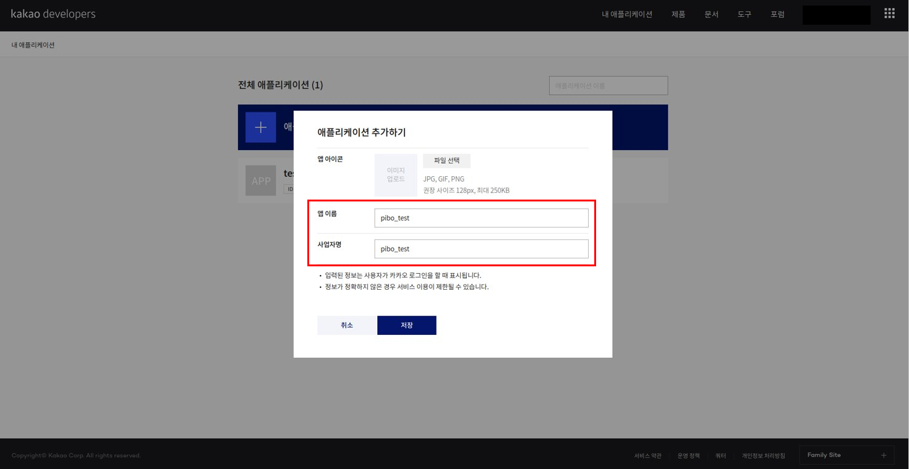
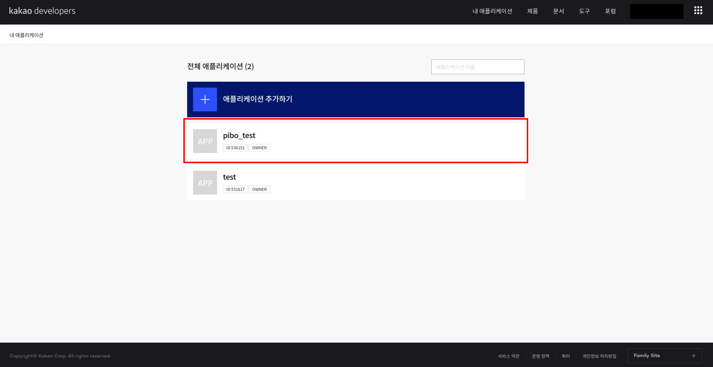
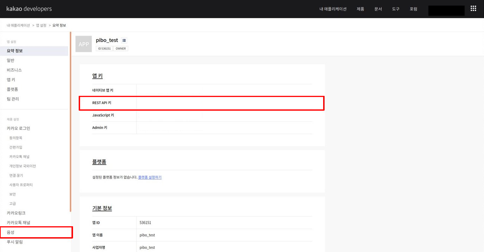
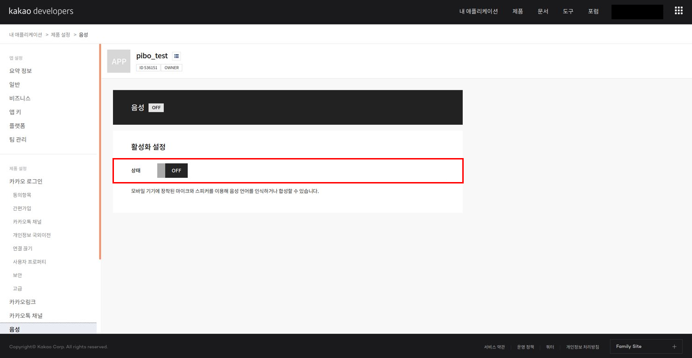
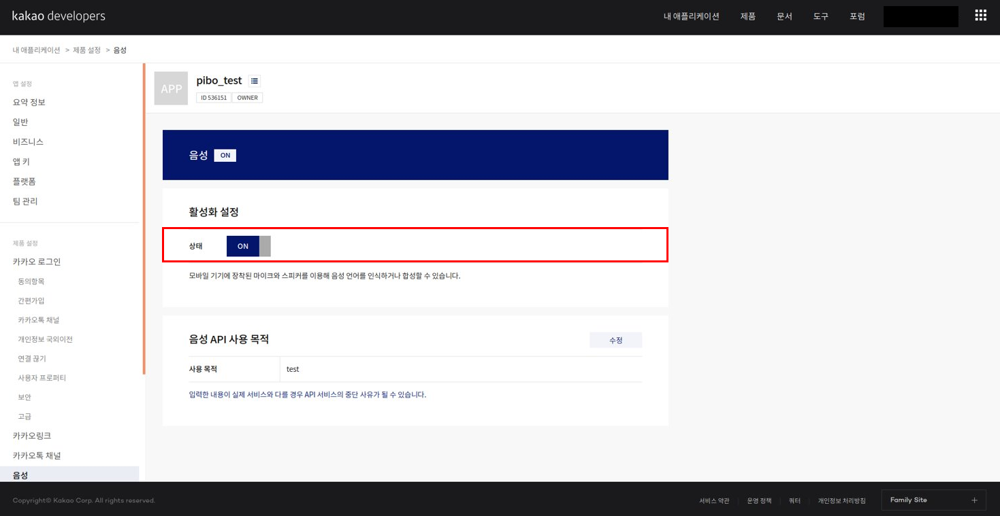

# KAKAO API

> 본 문서는 `KAKAO REST API KEY` 를 발급받는 방법에 대해 안내합니다.
> 
> openpibo 패키지의 **Speech** 라이브러리의 **TTS, STT**기능은 KAKAO API를 사용하기 때문에
>
> `KAKAO REST API KEY` 를 발급받아 ``config.json`` 파일에 저장해야합니다.
>
> 키 발급 방법은 [kakao developers](https://developers.kakao.com/)에 회원가입 후 다음 과정으로 진행합니다.

1. 로그인 후 [내 애플리케이션] 클릭

   

2. [애플리케이션 추가하기] 클릭

   

3. 앱 이름 및 사업자명 입력 후 저장

   

4. 새로 생성한 애플리케이션 클릭

   

5. config.py에 발급받은 REST API 키 입력 후, 왼쪽의 [음성] 클릭

   

6. 이후 `/home/pi/config.json`의 `KAKAO_ACCOUNT`에 발급받은 `REST API 키` 입력

   ```json
   {
       "DATA_PATH":"/home/pi/x-openpibo-data/data/",
       "KAKAO_ACCOUNT": "<여기에 발급받은 REST API 키를 입력해주세요>",
       "robotId": ""
   }
   ```

7. 활성화 설정의 [OFF] 버튼 클릭

   

8. 사용 목적 입력 후 저장

   

9. 활성화 설정의 상태가 [ON]으로 바뀌면 완료

   


