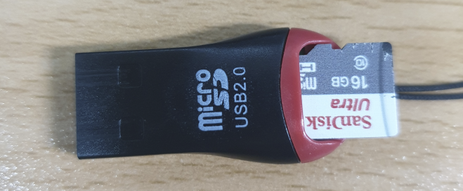
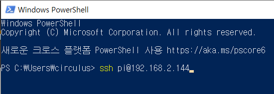
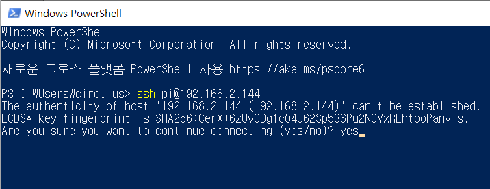
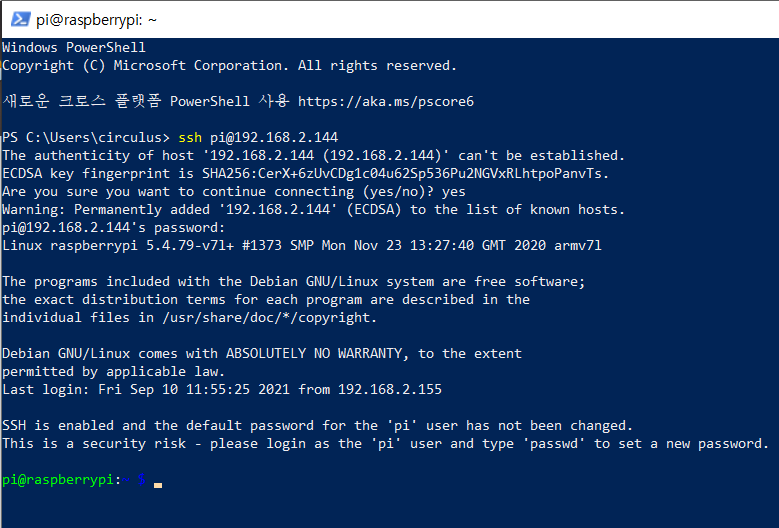

# 설정

서큘러스가 제공하는 OS와 openpibo API를 사용하기 위해 필요한 사전 설정을 다룹니다.

OS는 파이보 DIY 키트에 포함되어 있으며, 이후 [여기](https://drive.google.com/file/d/1IewZY1GY3rrg4O8pWO-VTMWKx-NWa1WQ/view)에서 다운로드 받을 수 있습니다. openpibo API는 [깃허브](https://github.com/themakerrobot/x-openpibo)에 업로드 하였으며, 누구나 다운로드 받아 활용할 수 있습니다.

## 무선 네트워크 설정

파이보를 사용하기 위해서는 다음과 같은 실습환경을 구성하여야 합니다.

###이미지###

이를 위해 선행해야할 것은 다음 절차를 따라 파이보를 무선 네트워크에 연결하고 IP주소를 확인하는 것입니다.

   1. 파이보 DIY 키트에 포함된 Micro SD Card를 리더기에 연결하고 컴퓨터 USB 포트에 연결합니다.

      

   2. Micro SD Card의 `boot` 폴더에서 `wpa_supplicant.conf` 파일을 수정합니다.

      

   3. 컴퓨터에서 Micro SD Card를 분리한 후 파이보에 연결합니다.

      

   4. 파이보를 부팅하고 설정한 무선 네트워크 정보가 정상적으로 보이는지 확인합니다.

      

   **[주의] 파이보를 부팅하게 되면 네트워크 설정이 완료된 후 `wpa_supplicant.conf` 파일이 사라집니다.**

   새로운 네트워크에 접속하려면, `wqa_supplicant.conf.bak` 파일을 복사하여 새로운 `wpa_supplicant.conf` 를 만들어 사용할 수 있습니다.

   


## SSH 연결

SSH란, 원격 컴퓨터에 접속하기 위해 사용하는 보안 프로토콜로 파이보와 실습에 사용할 컴퓨터가 같은 네트워크에 있다면 파이보에 접속할 수 있습니다.
SSH를 통해 파이보에 접속하고 파이보를 제어하거나 필요한 소프트웨어를 설치할 수 있습니다.

다음의 절차를 따라 SSH를 이용하여 파이보에 원격 접속합니다.

   1. 접속할 파이보의 IP주소, ID, PASSWORD를 확인합니다.  

      **IP주소    : 파이보의 OLED에서 확인할 수 있습니다.**  
      **ID       : pi**  
      **PASSWORD : raspberry**  
   
   2. 컴퓨터에서 사용할 SSH 프로그램을 확인합니다. 운영체제에 내장된 프로그램으로 무료로 사용할 수 있으며, 이하 `터미널`로 용어를 통일합니다.  

      **윈도우   : PowerShell**  
      **맥/리눅스: Terminal**  

   3. 터미널을 열고 원격 접속할 파이보 정보를 입력합니다. 정보를 입력하는 규칙은 다음과 같습니다.  

      **규칙: ID(호스트이름)@접속할 IP주소**  
      **예: pi@192.168.2.144**  
      

   4. 보안 설정에 동의합니다. 이는 최초 접속할 때만 출력되는 메시지입니다.

      

   5. 패스워드를 입력합니다. 패스워드를 입력할 때, 별도로 표시가 되지 않기 때문에 오타가 나지 않도록 주의합니다.

      

   6. SSH 접속을 확인합니다.

      


## openpibo 및 관련 패키지 설치

   openpibo 및 관련 패키지는 OS에 설치되어 있지만 필요에 따라 다시 설치할 수 있습니다.

   - openpibo 설치

      파이보를 조작하는 기능이 등러맀는 파일 모음입니다. 파이보 모션 제어, 오디오 재생 등에 필요한 패키지입니다.
      터미널에 아래와 같이 입력합니다.

      ```bash
      $ sudo pip3 install git+https://github.com/themakerrobot/x-openpibo

      # 또는

      $ git clone https://github.com/themakerrobot/x-openpibo.git # 패키지 파일 다운로드
      $ cd x-openpibo # 다운받은 패키지 폴더에 접근
      $ sudo python3 setup.py install # 패키지 설치
      ```
   - openpibo-tools 설치

      전자부품 상태 확인, 모션 제작 등에 필요한 실행 파일이 담긴 패키지입니다. 설치 방법은 다음과 같습니다.

      ```bash
      $ git clone https://github.com/themakerrobot/openpibo-tools.git
      ```

      자세한 사용 방법은 아래의 링크를 참고합니다.

      - [Process Test](https://themakerrobot.github.io/x-openpibo/build/html/tools/process_test.html)
      - [Motion Creator](https://themakerrobot.github.io/x-openpibo/build/html/tools/motion_creator.html)
      - [Device Simulator](https://themakerrobot.github.io/x-openpibo/build/html/tools/device_simulator.html)

   - openpibo-files 설치

      openpibo에서 사용 가능한 샘플 오디오, 아이콘, 이미지 파일 등이 담긴 패키지입니다.
      설치 방법은 다음과 같습니다.

      ```bash
      $ git clone https://github.com/themakerrobot/openpibo-files.git
      ```

      자세한 내용은 아래의 링크를 참고합니다.

      - [Audio](https://themakerrobot.github.io/x-openpibo/build/html/data/audio.html)
      - [Icon](https://themakerrobot.github.io/x-openpibo/build/html/data/icon.html)
      - [Image](https://themakerrobot.github.io/x-openpibo/build/html/data/image.html)

   - openpibo-examples 설치

      openpibo를 사용한 예제 파일이 담긴 패키지입니다. 패키지 안에 있는 파이썬 파일을 실행하여 결과를 확인할 수 있고, 팜고하여 프로그램을 만드는데 활용할 수 있습니다. 일부 파일에 사용하는 데이터는 openpibo-files에 있으므로 openpibo-files가 미리 설치되어 있어야 하며 설치 방법은 다음과 같습니다.

      ```bash
      $ git clone https://github.com/themakerrobot/openpibo-examples.git
      ```

   ## KAKAO Developer Key 발급

   openpibo에서 음성인식(STT)과 음성합성(TTS)을 위해 KAKAO를 사용합니다. KAKAO Developers에서 회원가입 및 Key 발급이 필요하며, 발급받는 방법은 [여기](https://themakerrobot.github.io/x-openpibo/build/html/notes/kakao_api.html)를 참고합니다.

   발급 받은 Key는 파이보의 /home/pi/에 있는 config.json 파일에 다음과 같이 저장합니다.

   ```json
   {
      "DATA_PATH":"/home/pi/openpibo-files/data/",
      "KAKAO_ACCOUNT": "<여기에 발급받은 REST API 키를 입력해주세요>",
      "robotId": ""
   }
   ```

> 파이보 조립 이후 파이보를 사용하기 위한 기본적인 설정 방법에 대해 안내합니다.

1. 무선 인터넷(wifi)을 연결합니다.

   - microSD카드를 USB 어뎁터에 연결하고, 이를 컴퓨터에 연결합니다.

   
   
   - microSD카드의 `boot` 디렉토리에서 `wpa_supplicant.conf` 파일을 수정합니다.

     ```
     country=KR
     ctrl_interface=DIR=/var/run/wpa_supplicant GROUP=netdev
     network={
         ssid="YOUR_NETWORK_NAME"
         psk="YOUR_PASSWORD"
         key_mgmt=WPA-PSK
     }
     ```

     - `YOUR_NETWORK_NAME` : 접속하려는 wifi 이름을 입력합니다.
     - `YOUR_PASSWORD` : 접속하려는 wifi의 비밀번호를 입력합니다.

      예시:

     ```
     country=KR
     ctrl_interface=DIR=/var/run/wpa_supplicant GROUP=netdev
     network={
         ssid="circulus"
         psk="password1234"
         key_mgmt=WPA-PSK
     }
     ```

   **<주의> microSD카드로 부팅을 하게되면 `wpa_supplicant.conf` 파일이 사라집니다.**

      만약 새로운 네트워크에 접속하려면, `wpa_supplicant.conf.bak` 파일을 복사하여
      
      새로운 `wpa_supplicant.conf` 를 만들어 wifi 설정 후 사용합니다.

      

2. 파이보에 microSD카드 결합 후 전원을 켭니다.

   

   파이보의 등 우측 부분에 microSD카드 삽입 포트에 결합합니다.

   이 때, 사진과 같이 microSD카드의 금박 부분을 바라보는 방향으로 삽입합니다.

3. 컴퓨터에서도 1번에서 파이보에 연결한 wifi와 동일한 네트워크에 접속합니다.

   

4. 컴퓨터에서 파이보로 ssh 접속 합니다.

   > SSH(Secure Shell)란, 원격지 호스트 컴퓨터에 접속하기 위해 사용되는 인터넷 프로토콜입니다.
   >
   > PC로 파이보에 접속하여 사용하기 위해 SSH를 사용합니다.

   터미널 창을 켜고 다음과 같이 입력합니다.

   *<참고> 여기서 터미널은 운영체제마다 다릅니다.*
   *windows에서는 **PowerShell**이고, linux에서는 **Terminal** 입니다.*

   ```
   ssh pi@xxx.xxx.xxx.xxx
   ```

   

   이 때, `xxx.xxx.xxx.xxx` 에는 파이보의 IP 주소를 입력합니다.

   이 숫자는 파이보 가슴의 OLED에서 확인할 수 있습니다.

   

   IP를 입력하면, 다음과 같은 메시지가 출력됩니다.

   

   처음으로 파이보에 ssh로 접속할 때 출력되는 메시지로, 보안키를 생성한다는 메시지 입니다.

   `yes` 를 타이핑하여 보안키를 생성합니다.

   

   패스워드를 입력합니다.

   파이보를 처음 실행시킬때 기본 비밀번호는 `raspberry` 로 설정되어있습니다.

   이 때 타이핑을 해도 반응이 없어보이지만 입력되는 중이기 때문에, 그냥 비밀번호를 타이핑하고 엔터를 치면 됩니다.

   

   연결이 완료되면 위 그림과 같이 코드 맨 아래에 `pi@raspberrypi:~ $` 가 출력됩니다.

## 부가 설정

> 부가적인 기능을 사용하거나 패키지, 도구를 재설치하는 방법에 대해 안내합니다.

1. TTS(텍스트를 음성으로 변환), STT(음성을 텍스트로 변환) 등의 기능을 사용하기 위한 설정을 합니다.

   openpibo의 TTS와 STT는 KAKAO에서 제공하는 서비스를 사용합니다.
   
   해당 서비스를 이용하기 위해 kakao developers에 회원가입 후 REST API KEY를 발급받아 `config.json` 에 저장합니다.

   해당 설정을 하는 방법은 [여기](https://themakerrobot.github.io/x-openpibo/build/html/notes/kakao_api.html)를 참고해주세요.

2. 각종 x-openpibo 패키지와 도구들을 설치하는 방법입니다.

   파이보 제품을 받았을 때 기본적으로 설치가 되어 있지만,

   데이터를 잃어버리거나 실수로 중요한 파일을 수정했을 경우 패키지와 도구를 재설치 할 때 사용합니다.

   - 패키지 설치

      패키지는 파이보를 조작하는 기능이 있는 파일들입니다.

      파이보의 모터를 움직이거나, 오디오를 재생하는 등의 기능을 할 수 있도록 합니다.

      ```bash
      $ sudo pip3 install git+https://github.com/themakerrobot/x-openpibo
      
      # 또는
      
      $ git clone https://github.com/themakerrobot/x-openpibo.git # 패키지 파일 다운로드
      $ cd x-openpibo # 다운받은 패키지 폴더에 접근
      $ sudo python3 setup.py install # 패키지 설치
      ```

   - 추가 도구 설치

      - openpibo-tools

         파이보를 다루는데 여러가지 도움을 주는 도구모음입니다.

         파이보 조립 후 조립이 잘 됐는지 확인하거나, 파이보의 모션을 만드는 등의 일을 할 수 있습니다.

         ```bash
         $ git clone https://github.com/themakerrobot/openpibo-tools.git
         ```

      - openpibo-examples

         패키지를 사용한 예제 코드들의 모음입니다.

         패키지를 어떻게 사용해야 하는지 알고 싶을 때 참고할 수 있습니다.

         참고로, `openpibo-files`의 데이터를 사용하기 때문에,
         
         예제코드를 사용하기 전에 `openpibo-files`도 정상적으로 설치되어있어야 합니다.

         ```bash
         $ git clone https://github.com/themakerrobot/openpibo-examples.git
         ```
      
      - openpibo-files

         샘플로 사용할 수 있는 간단한 데이터 모음입니다.

         오디오, 아이콘, 이미지 파일이 들어있습니다.

         ```bash
         $ git clone https://github.com/themakerrobot/openpibo-files.git
         ```
