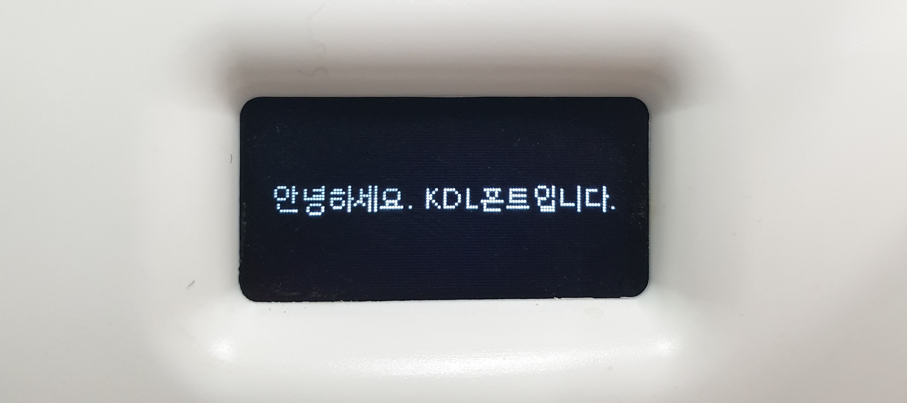

# 폴더 구조

openpibo 패키지의 폴더 구조에 대해 설명합니다.

openpibo 패키지는 파이보를 제어하기 위한 라이브러리 및 최소한의 파일들을 포함하고 있습니다.
크게 data, modules, libraries 파트로 나뉘어져 있습니다.

```
openpibo
├── __init__.py
├── data
│   └── models
│       ├── KDL.ttf
│       ├── motion_db.json
│       ├── sample_db.json
│       ├── MobileNetSSD_deploy.caffemodel
│       ├── MobileNetSSD_deploy.prototxt.txt
│       ├── age_net.caffemodel
│       ├── deploy_age.prototxt
│       ├── deploy_gender.prototxt
│       ├── dialog.csv
│       ├── dlib_face_recognition_resnet_model_v1.dat
│       ├── gender_net.caffemodel
│       ├── haarcascade_frontalface_default.xml
│       └── shape_predictor_5_face_landmarks.dat
├── modules
│   ├── __init__.py
│   ├── collect
│   │   ├── __init__.py
│   │   └── get_soup.py
│   ├── oled
│   │   ├── __init__.py
│   │   ├── board.py
│   │   ├── busio.py
│   │   ├── chip.py
│   │   ├── digitalio.py
│   │   ├── framebuf.py
│   │   ├── pure_spi.py
│   │   ├── spi.py
│   │   ├── spi_device.py
│   │   ├── ssd1306.py
│   │   └── util.py
│   ├── speech
│   │   ├── __init__.py
│   │   ├── constant.py
│   │   └── google_trans_new.py
│   └── vision
│       ├── __init__.py
│       └── stream.py
├── motion.py
├── audio.py
├── collect.py
├── device.py
├── edu_v1.py
├── oled.py
├── speech.py
└── vision.py
```

## data
  폰트 파일, 모션 데이터베이스, 그리고 각종 인공지능 모델 등 라이브러리를 사용하기 위한 최소한의 데이터가 들어있습니다.

  ```
  openpibo/data/models/
  ├── KDL.ttf
  ├── motion_db.json
  ├── sample_db.json
  ├── dialog.csv
  ├── MobileNetSSD_deploy.caffemodel
  ├── MobileNetSSD_deploy.prototxt.txt
  ├── age_net.caffemodel
  ├── deploy_age.prototxt
  ├── deploy_gender.prototxt
  ├── dlib_face_recognition_resnet_model_v1.dat
  ├── gender_net.caffemodel
  ├── haarcascade_frontalface_default.xml
  └── shape_predictor_5_face_landmarks.dat
  ```

  - KDL.ttf
  
    oled에 텍스트를 출력할 때 사용하는 기본 글씨체입니다.

    

  - motion_db.json, sample_db.json

    motion_db.json은 파이보에 기본적으로 저장되어있는 동작이 저장되어있는 데이터베이스로, 저장된 모션 리스트는 다음과 같습니다.

    ```
    stop, stop_body, sleep, lookup, left, left_half, right, right_half, foward1-2,
    backward1-2, step1-2, hifive, cheer1-3, wave1-6, think1-4, wake_up1-3, hey1-2,
    yes_h, no_h, breath1-3, breath_long, head_h, spin_h, clapping1-2, hankshaking,
    bow, greeting, hand1-4, foot1-2, speak1-2, speak_n1-2, speak_q, speak_r1-2, 
    speak_l1-2, welcome, happy1-3, excite1-2, boring1-2, sad1-3, handup_r, 
    handup_l, look_r, look_l, dance1-5, motion_test, test1-4
    # foward1-2는 forward1, forward2 두 종류가 있음을 의미합니다.
    ```

    sample_db.json은 json 파일 양식이 저장되어있습니다.

    ```json
    // sample_db.json
    {
      "name": {
        "comment":"description of this motion",
        "init_def":0,
        "init":[0,0,-70,-25,0,0,0,0,70,25],
        "pos":[
          { "d": [ 0, 0, 0, 0, 0, 0, 0, 0, 0, 0 ] , "seq": 0 }
        ]
      }
    }
    ```

    새로운 모션을 만들기 위해서는 위의 양식을 갖춰야하며, [Motion Creator](https://themakerrobot.github.io/x-openpibo/build/html/tools/motion_creator.html)를 이용해 간편히 만들 수 있습니다.


## modules

## libraries