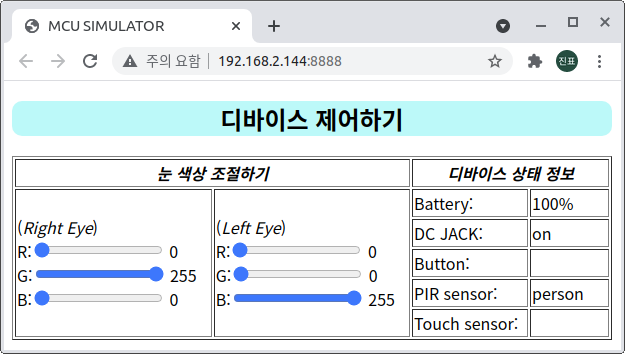

# Device Simulator

> 파이보의 device를 제어할 수 있는 툴 입니다.
>
> 디바이스 부품(neopixel, battery, dc, button, pir, touch)을 제어하거나 상태를 확인할 수 있습니다.
>
> `Chrome` 브라우저 사용을 권장합니다.

__사용 방법__

```python
cd ~/x-openpibo-tools/device-simulator
sudo python3 main.py --port 8888
```

- 프로그램을 실행합니다.

  `--port` : 연결할 포트를 입력합니다. 만약 설정하지 않으면, 기본 포트는 `8888`입니다.

  이후 `http://<PIBO IP>:8888`에 접속

  

  

- 죄측 입력 바를 조작하여 **Neopixel** 을 제어할 수 있습니다.

  

  

  

- 우측 테이블에서는 디바이스 상태 정보를 확인할 수 있습니다.

  - 배터리 잔량
  - 전원케이블 연결 상태
  - 전원버튼 누름상태
  - PIR센서 신호
  - 터치센서 신호