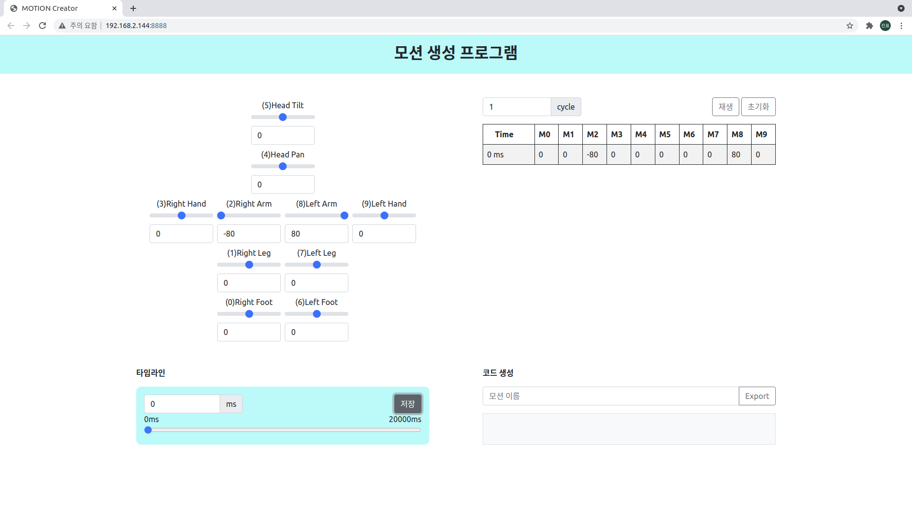
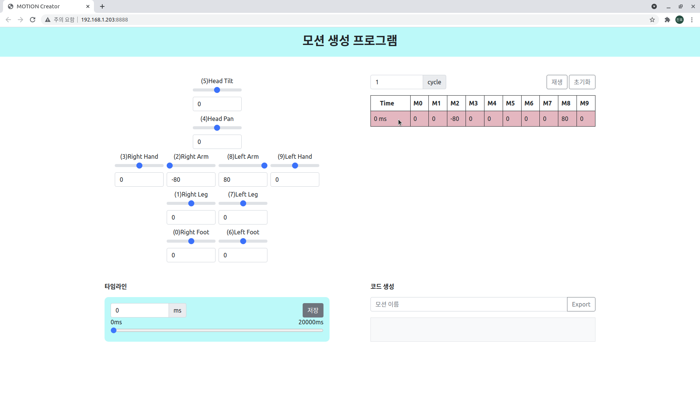

# Motion Creator

> 파이보의 동작을 생성하는 툴 입니다.
>
> `Chrome` 브라우저 사용을 권장합니다.

__사용 방법__

```python
$ cd ~/x-openpibo-tools/motion-creator
$ sudo python3 main.py --port 8888
```

- 프로그램을 시작합니다.

  `--port` : 연결할 포트를 입력합니다. 만약 설정하지 않으면, 기본 포트는 `8888`입니다.
  
  
  
  
  
  이후 `http://<PIBO IP>:<PORT>`에 접속합니다.
  
  (출력된 주소를 `ctrl + click` 해도 됩니다)


- 모션을 생성합니다.

  

  
  
  - 왼쪽은 모터를 제어하는 부분이고, 오른쪽은 저장된 모션이 보여지는 부분입니다.
  
  - 왼쪽의 입력값을 조작하면 파이보의 모터가 실시간으로 움직입니다.
  
  - 시간을 설정하고 아래 저장 버튼을 누르면 오른쪽 테이블에 동작 하나가 추가됩니다.
  
    (시간은 50ms 간격으로 설정할 수 있습니다.)
  
    
  
    
  
  - 동작테이블 각 행에 마우스를 올리면 빨간색으로 변하고, 클릭하면 해당 동작이 삭제됩니다.
  
    
  
    
  
  - 동작을 테스트하려면, 우측 상단의 `재생` 버튼을 누릅니다.
  
    `cycle` 을 설정해 여러번 반복할 수도 있습니다. (cycle이 3이면, 동작이 3번 반복됩니다.)
  
    
  
    
  
  - 우측 하단 입력창에 모션 이름을 적고 `Export` 버튼을 누르면, 코드가 생성됩니다.
  
    
  
    또한 `/motion-creator/` 경로에 `<모션 이름>.json` 의 이름으로도 저장된 것을 확인할 수 있습니다.
  
    
  
    
  
  - 우측 상단의 `초기화` 버튼을 누르면, 기록했던 동작들이 모두 초기화됩니다.
  
    
  
    
  
- 생성한 모션을 사용합니다.

  ```python
  >>> from openpibo.motion import Motion
  
  >>> pibo_motion = Motion()
  >>> pibo_motion.set_profile('hello.json')	 # 생성된 json 파일 경로 입력
  >>> pibo_motion.get_motion()				 # ['hello']
  
  >>> pibo_motion.set_motion('hello')			 # 동작 실행
  ```

  또는 생성한 파일에서 코드를 복사해서 사용할 수 있습니다.